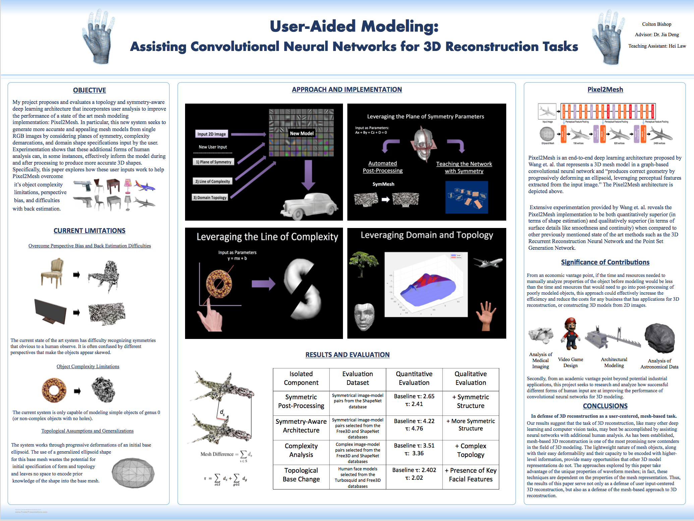
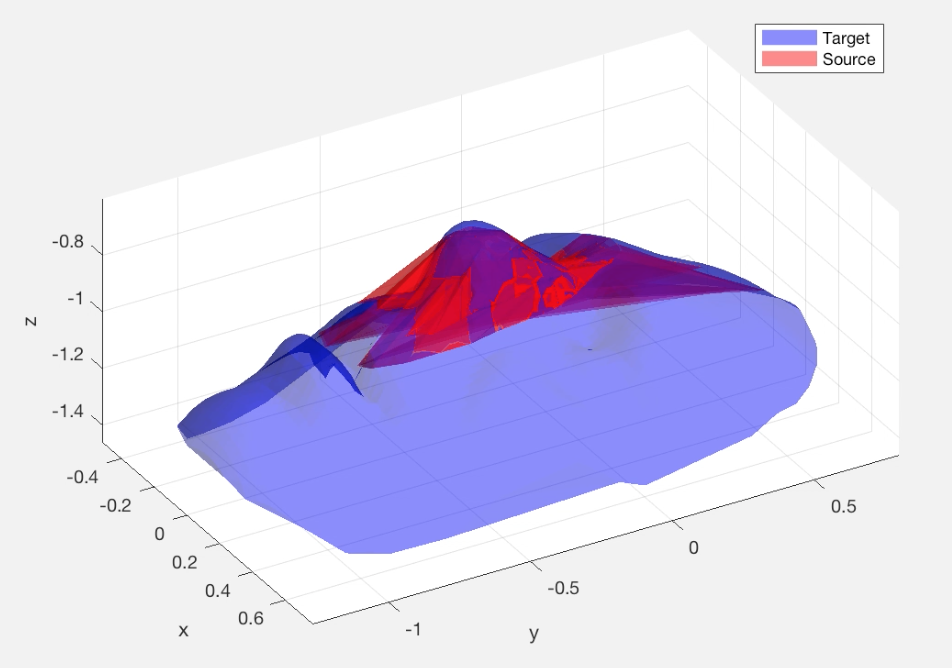
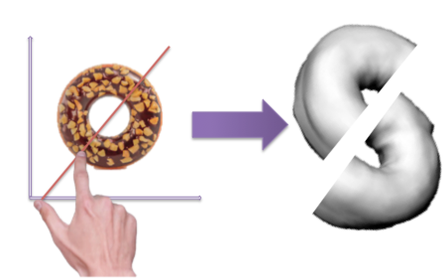
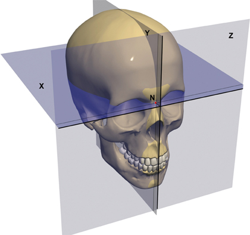

# Donatello

Donatello is the TensorFlow implementation of my [research](bishopcolton.com) which proposes a topology and symmetry-aware deep learning architecture that incorporates user analysis to build upon a state of the art approach for generating 3D mesh models from 2D images described in [this paper](http://openaccess.thecvf.com/content_ECCV_2018/papers/Nanyang_Wang_Pixel2Mesh_Generating_3D_ECCV_2018_paper.pdf).

 

 
